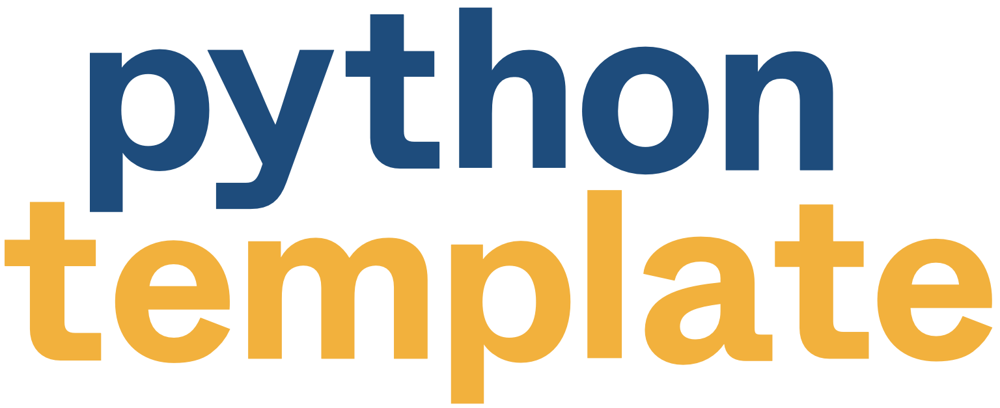

<div align="center">
    
    <h1 align="center">Python Cookiecutter template</h1>
</div>

<p align="center">
    An opinionated cookiecutter template for Python libraries.
</p>


## Repository structure

Once generated, your repository will look like this:

```
.
├── scratch/                # Scratchpad directory (ignored by git)
├── src/                    
│   └── {{project_slug}}    # Where your code will live
├── tests/                  # Tests
└── README.md
```